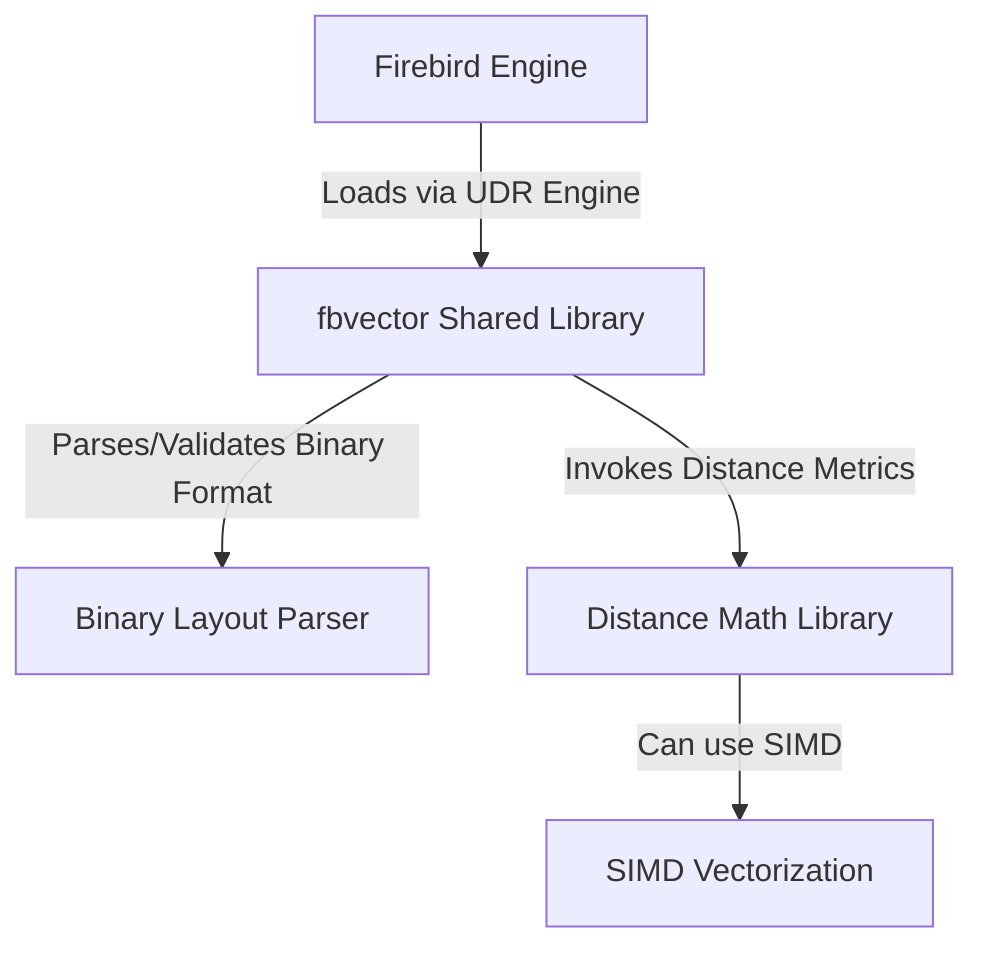

# Architecture

The `fbvector` extension is a User-Defined Routine (UDR) library for the Firebird Database Engine. It enables native high-dimensional vector storage and similarity searches, drawing design inspiration from PostgreSQL's `pgvector`.

## High-Level Component Overview

## Vector Representation & Storage Layout

Vectors are stored as binary buffers to maximize storage efficiency and retrieval performance.

### Serialization Layout

The serialized binary representation contains a 4-byte header representing the dimension count, followed by a contiguous array of IEEE 754 single-precision float values (4 bytes per float).

| Field | Type | Size (Bytes) | Description |
|---|---|---|---|
| `dimensions` | `uint32_t` | 4 | Number of vector elements (dimension size) |
| `data` | `float[]` | `4 * dimensions` | Contiguous array of floats |

For a vector of dimension $N$, the total binary storage size is exactly $4 + 4N$ bytes.

### Database Type Mapping

Firebird databases can store this binary payload in two different ways depending on application size constraints:
1. **`VARCHAR(N) CHARACTER SET OCTETS`**: Recommended for performance on small to medium-sized vectors (e.g. up to 1536 dimensions, which requires exactly 6148 bytes). Storing vectors inline in tables avoids the overhead of blob storage.
2. **`BLOB SUB_TYPE BINARY`**: Suitable for vectors of any size, removing database row length limit constraints.

Our UDR functions dynamically inspect parameter metadata to support both formats transparently.

## User-Defined Routine (UDR) Interface

Firebird's C++ Object-Oriented UDR API is utilized. When a SQL function is called, the Firebird engine passes a pointer to the input message buffer containing:
- The argument values
- The argument null indicators (2-byte short flags)

The `fbvector` library's `extract_vector_cached` helper parses the input metadata, reads the null offsets, decodes the vector layout, and exposes the data as a C++20 `std::span<const float>` to the math functions.

If a `BLOB` argument is provided, the UDR library calls Firebird's `IBlob` interface to sequentially stream segments from database storage into memory before parsing.

## Distance Calculation Engine

Distance operations are located in `src/distance.cpp`. They receive input as C++20 `std::span` objects, ensuring zero-copy access for VARCHAR storage.

The following distance metrics are implemented:
- **L2 (Euclidean) Distance**: $\sqrt{\sum (a_i - b_i)^2}$
- **Cosine Distance**: $1 - \frac{\sum a_i b_i}{\sqrt{\sum a_i^2} \sqrt{\sum b_i^2}}$
- **Dot Product**: $\sum a_i b_i$

To ensure performance, compiler flags such as `-O3` and `-ffast-math` are specified in `CMakeLists.txt` to trigger compiler auto-vectorization.
